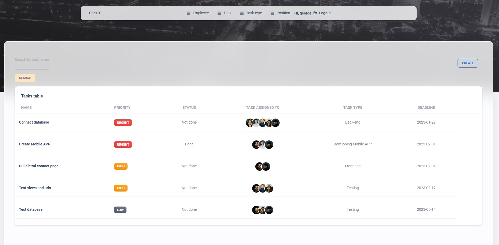

# Task Manager Project

A powerful tool for managing tasks and meeting deadlines.
This is a Task Manager that makes it easy for you to keep track of all Tasks, Task types, Employees and their positions

## Try it out

Task Manager project deployed to Render -
* https://it-task-manager-y0dz.onrender.com/

Use the following user to log in and check the functionality of the website: 

```shell
login: george
password: 13570530
```

## Features

* Authentication functionality for Employee/User
* New tasks can be added and kept all in one list 
* Tasks can be delegated to certain employees and tracked
* Each employee has his own detail page with completed and uncompleted task displayed separately
* All tasks can be prioritised to manage time more effectively and  hit deadlines
* custom admin panel

## Demo





## Installation 

Python3 must be already installed

```shell
git clone https://github.com/GeorgePavlej/it-task-manager.git
cd it-task-manager
python3 -m venv venv
source venv/bin/activate  # on macOS
venv\Scripts\activate  # on Windows 
pip install -r requirements.txt
copy .env.sample -> .env and populate with all required data
python manage.py migrate
python manage.py runserver #starts Django Server
```

<br />
